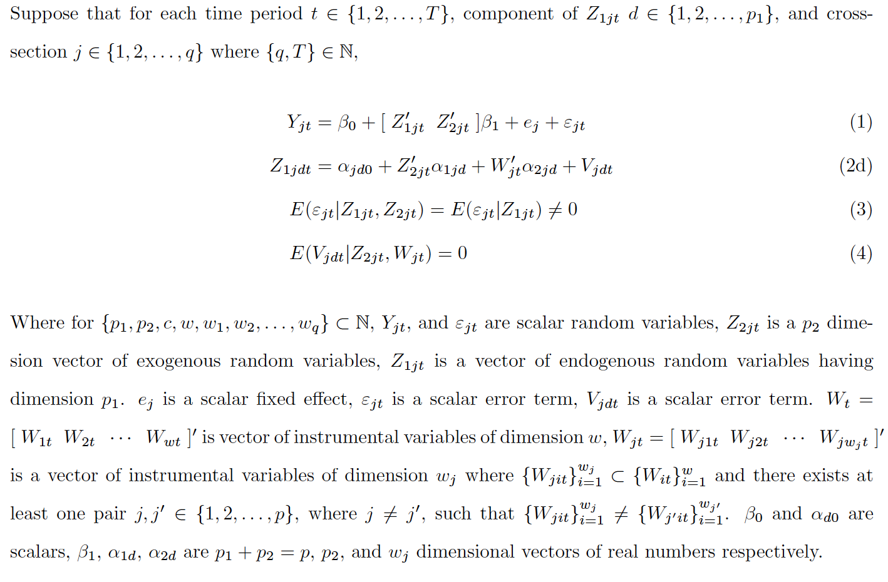

<h1> Selection of Heterogenous Instruments in Fixed Effect Panel Regression </h1>

<h3> By Eric Penner </h3>

<h4> Summary: </h4> This repository contains a short summar, and supplemental Monte Carlo exercise for the working paper currently entitled "Selection of Heterogenous Instruments in Fixed Effect Panel Regression" and previously entitled "Panel Selection and Control". This purpose of this paper is the estimation of the parameters of (1) in the following system of equations.

  <h3>Jupyter Notebooks</h3>
 The Monte Carlo Exercise contained herein is written in python3 and contained in jupyter notebooks. If you are not familiar with jupyter notebooks clicking on the following image will take you to a youtube video describing them.

<h3> My Binder </h3>

If this repo is currently public you can launch it live by clicking the following widget.

 <h3> Contents </h3>

 * .tex/.pdf documents

   * psc_proposal.pdf: self explanatory

 * jupyter notebooks:

    * psc_dgp.ipynb : Details/Code which generated the data for the Monte Carlo exercise.

    * psc.ipynb : Details/Code for the estimation procedure for $beta_1$.     

    * trials_out.ipynb: Tables and interactive plots details the result of Monte Carlo trials.

    * psc_out.ipynb: Same as trials, just without functions included.

* data_sum:

    * Folder with summary information about data sets use to generate result in est_out folder

* est_out:

    * Result of monte carlo ex generated by psc and summarized in trials_out.

* examples:

    * psc and psc_dgp exported to html, note interactive plots are missing.

* .py scripts

    - kernel.py: Kernel function module

    * psc_sumdsp.py: Interactive plotting and table module

* .yml scripts

    - environment.yml: for mybinder.org

<h4> Contact </h4> All comments or questions can be directed to epenner@berkeley.edu
